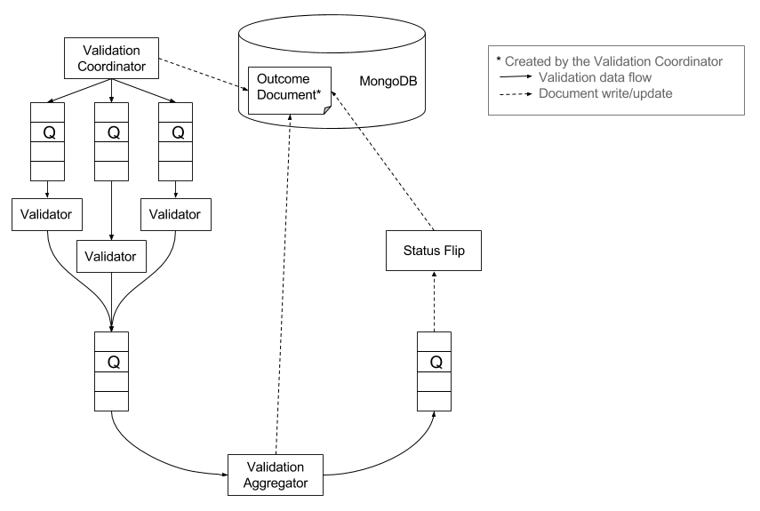

# Validator Prototype
[](https://travis-ci.org/EMBL-EBI-SUBS/validator-prototype)

**This is a prototype version of the meta-data validator for the USI project.**



## Getting Started

These instructions will get you a copy of the project up and running on your local machine for development and testing purposes.

### Prerequisites
What you'll need to run the validator-prototype:
- [Java 1.8](http://www.oracle.com/technetwork/java/javase/downloads/index-jsp-138363.html)
- [Gradle](https://gradle.org/)
- [MongoDB](https://www.mongodb.com/download-center?jmp=nav#community)
- [RabbitMQ](https://www.rabbitmq.com/)

Follow any of the links to download and find instructions on how to install these.

### Installing
Clone the repository:
```
git clone https://github.com/EMBL-EBI-SUBS/validator-prototype.git
```
Start up both MongoDB and RabbitMQ, if you are using :beer: [Homebrew](https://brew.sh/) do:
```
brew services start mongodb
brew services start rabbitmq
```
Build the project:
```
cd validator-prototype
gradle build
```
And make sure everything is ok, as in: `BUILD SUCCESSFUL`

### Starting
Start application components by doing (the order is not important):
```
cd validator-coordinator
gradle bootRun
```
```
cd mock-validators
gradle bootRun
```
```
cd validator-aggregator
gradle bootRun
```
```
cd validator-status-flipper
gradle bootRun
```
You can now start using this prototype by publishing a [SubmittableValidationEnvelope](https://github.com/EMBL-EBI-SUBS/validator-prototype/blob/master/validator-core/src/main/java/uk/ac/ebi/subs/validator/data/SubmittableValidationEnvelope.java) to the `SUBMISSION_VALIDATOR` queue. You should then be able to see the dummy validation results on your local MongoDB.

## License

See the [LICENSE](LICENSE.md) file for license rights and limitations (Apache 2.0).
